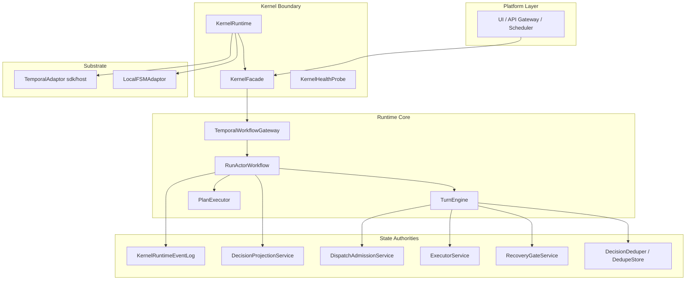
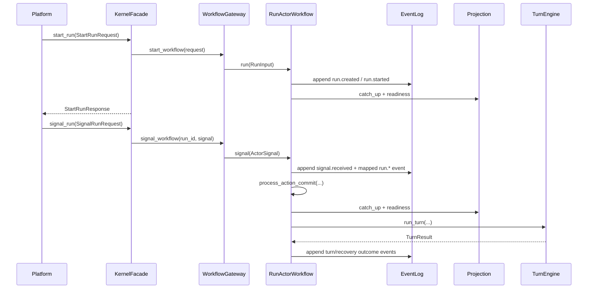
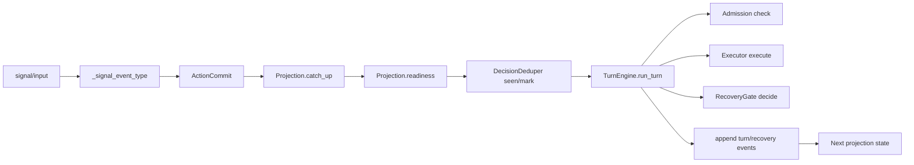
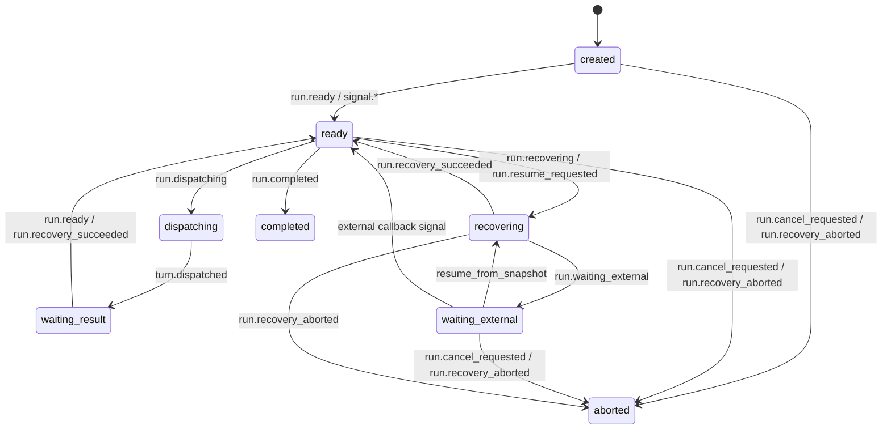

# ARCHITECTURE

本文档描述 `agent-kernel` 当前可执行实现的架构设计，重点覆盖：
- 设计逻辑如何演进到当前形态
- 分层职责和调用边界
- 核心状态机与调用关系
- 与规模化运行相关的约束与扩展点

## 1. 设计逻辑演进

### 1.1 演进目标

`agent-kernel` 的核心目标不是“封装一次模型调用”，而是提供一个可长期运行、可恢复、可治理的执行内核：
- 运行不丢（durable / restart-safe）
- 状态可重建（event -> projection）
- 副作用可控（admission + dedupe + recovery）
- 接口稳定（platform 只面向 facade）

### 1.2 演进阶段

1. 单次执行阶段（早期 PoC）
- 问题：执行链路与状态混在一起，失败后难以恢复。
- 改进方向：把生命周期、状态、执行、副作用治理拆开。

2. 权威拆分阶段（六权威）
- 引入六权威职责：`RunActor`、`EventLog`、`Projection`、`Admission`、`Executor`、`RecoveryGate`。
- 结果：事实（event）与视图（projection）分离，恢复路径可审计。

3. substrate 解耦阶段
- 将 Temporal 作为“可插拔执行底座”，通过 `TemporalWorkflowGateway` 抽象隔离 SDK 细节。
- 结果：同一套 kernel 逻辑可运行在 `Temporal(sdk/host)` 或 `LocalFSM`。

4. 协作增强阶段
- 增加 `plan_submitted` / `approval_submitted` / `speculation_committed`。
- 增加 TRACE 相关能力：branch/stage/human_gate/task_view。
- 结果：支持更复杂的人机协作与平台化观测。

## 2. 系统分层与依赖

分层约束：
- 平台层禁止直接调用 substrate 或 workflow。
- 业务读状态走 `Facade.query_*`，不直接读 event log。
- 生命周期推进只由 `RunActorWorkflow` 驱动。

## 3. 六权威职责模型

| 权威组件 | 角色 | 关键责任 | 代码位置 |
|---|---|---|---|
| RunActor | 生命周期权威 | 驱动 run 启动、信号处理、回合推进 | `agent_kernel/substrate/temporal/run_actor_workflow.py` |
| EventLog | 事实权威 | 追加不可变事件、提供回放基线 | `agent_kernel/kernel/minimal_runtime.py` |
| Projection | 视图权威 | 从事件重建 run 视图，提供 query/readiness | `agent_kernel/kernel/minimal_runtime.py` |
| Admission | 副作用准入权威 | 执行前策略检查与准入包络 | `agent_kernel/kernel/minimal_runtime.py` |
| Executor | 执行权威 | 执行动作（tool/mcp/...）并返回结果 | `agent_kernel/kernel/minimal_runtime.py` |
| RecoveryGate | 恢复权威 | 失败后恢复决策（补偿/人工/终止） | `agent_kernel/kernel/minimal_runtime.py` |

## 4. 核心调用关系

### 4.1 Run 启动与信号处理主链路

### 4.2 RunActor 内部依赖调用

### 4.3 信号到权威事件映射（关键片段）

`RunActorWorkflow` 中 `_SIGNAL_EVENT_TYPE_MAP` 将 transport signal 归一到权威事件：
- `resume_from_snapshot -> run.resume_requested`
- `cancel_requested -> run.cancel_requested`
- `timeout -> run.waiting_external`
- `hard_failure -> run.recovery_aborted`
- `plan_submitted -> run.plan_submitted`
- `approval_submitted -> run.approval_submitted`
- `speculation_committed -> run.speculation_committed`

## 5. 生命周期状态机

`RunLifecycleState` 当前值：
`created | ready | dispatching | waiting_result | waiting_external | recovering | completed | aborted`

状态机约束：
- `run.cancel_requested` 是权威生命周期事实，不是“仅通知”。
- `completed/aborted` 后不允许低优先级运行态事件覆盖。
- `projection` 是查询真相，事件是重建来源。

## 6. 接口边界与一致性约束

1. 入口边界
- 平台层只通过 `KernelFacade` 进入内核。
- 不直接使用 `Temporal` SDK 对 run 写入业务信号。

2. 一致性边界
- EventLog append-only，不允许原地修改历史。
- Projection 只能由事件回放推进。
- Recovery 决策必须走 `RecoveryGateService`。

3. 副作用边界
- 任何副作用先过 `Admission`。
- 幂等状态通过 `DecisionDeduper/DedupeStore` 跟踪。
- 失败后的处理必须形成 recovery 事件闭环。

## 7. Substrate 选择与取舍

| 模式 | 配置 | 优势 | 限制 | 推荐场景 |
|---|---|---|---|---|
| Temporal SDK | `TemporalSubstrateConfig(mode="sdk")` | 外部集群、持久化与稳定性最佳 | 依赖外部 Temporal 基础设施 | 生产 |
| Temporal Host | `TemporalSubstrateConfig(mode="host")` | 单机可自举、便于本地/CI | 仍需 Temporal testing 依赖 | 开发/集成测试 |
| LocalFSM | `LocalSubstrateConfig(...)` | 轻量、无外部依赖 | 无 durable history、无跨进程隔离 | 单进程测试/嵌入式场景 |

## 8. 扩展面与规模化建议

### 8.1 可扩展点
- 类型注册：`action_type` / `plan_type` / `event_type` / `recovery_mode`
- 观测扩展：`ObservabilityHook`、event export
- 数据平面扩展：event log / dedupe / task view 的持久化后端

### 8.2 大规模工程落地建议

1. 生产优先使用 `Temporal(sdk)` + 持久化 event log。
2. 平台侧在启动时缓存 `KernelManifest`，做能力协商。
3. 统一约束 signal taxonomy，避免 ad-hoc signal 语义漂移。
4. 对 `task.*`、`human_gate.*`、`branch/stage` 事件建立监控面板。
5. 将“事件 schema 版本 + 回放校验”纳入发布门禁。
