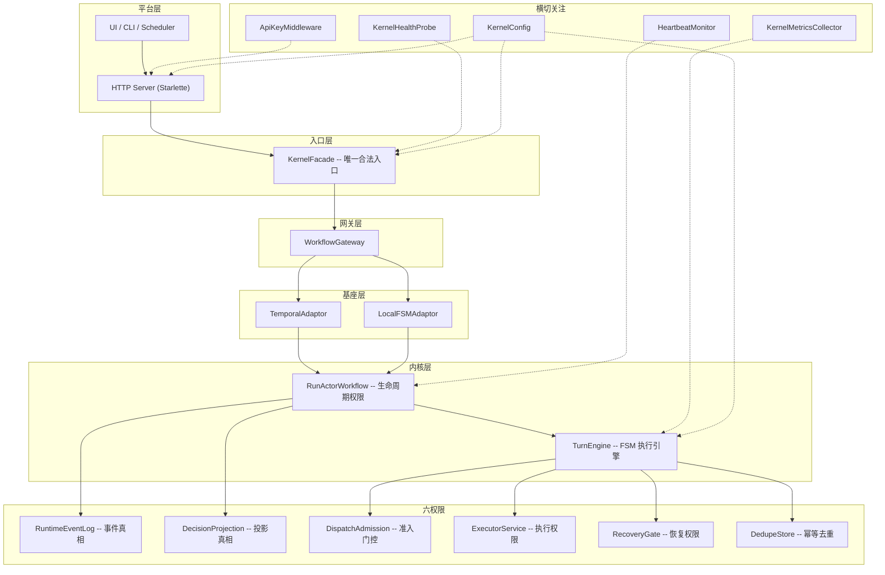
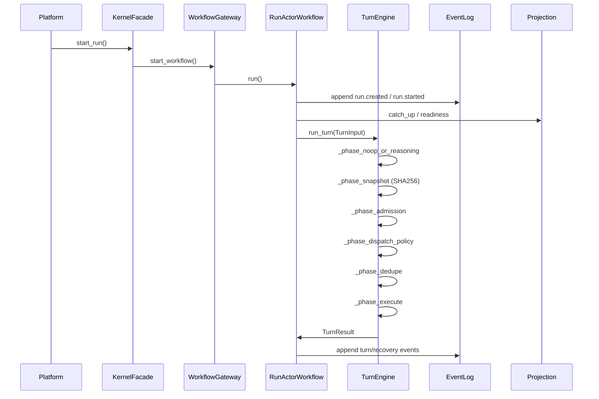
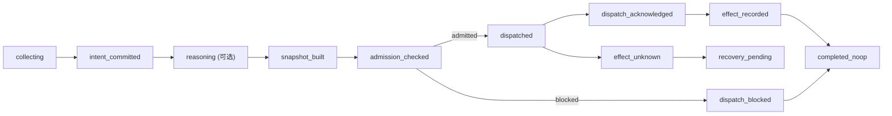
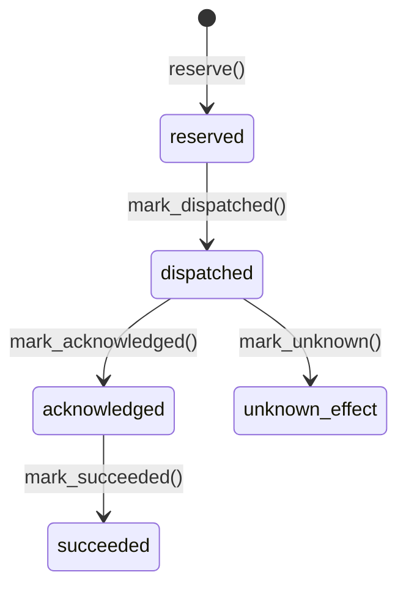

# ARCHITECTURE

agent-kernel v0.2.0 -- 企业级 Agent 内核，基于六权限生命周期协议构建。

---

## 1. 架构分层



边界约束:

- 平台层必须通过 `KernelFacade` 访问内核，不得旁路写状态。
- 生命周期推进由 `RunActorWorkflow` 统一驱动。
- 六权限之间不可旁路调用，每一层只能通过上层权限入口进入下层。
- 查询走投影 (projection)，不直接拼装事件。
- Temporal 工作流是纯耐久壳：所有业务逻辑在内核服务中实现。

---

## 2. 六权限模型

| 权限 | 实现 | 职责 | 核心不变量 |
|------|------|------|-----------|
| **RunActor** | `substrate/temporal/run_actor_workflow.py` | 生命周期权限；拥有 run 推进循环 | 只有 RunActor 写 run 级生命周期事件 |
| **RuntimeEventLog** | `kernel/minimal_runtime.py`, `kernel/persistence/` | Append-only 事件真相源 | 事件一旦写入不可变更；所有状态变化必须经过事件 |
| **DecisionProjection** | `kernel/minimal_runtime.py`, `kernel/persistence/sqlite_projection_cache.py` | 投影真相；从 `authoritative_fact` 和 `derived_replayable` 事件重放构建 | 投影可从事件日志完整重建；`derived_diagnostic` 事件不参与重放 |
| **DispatchAdmission** | `kernel/turn_engine.py` (AdmissionPort) | 外部副作用唯一门控 | `approval_state` 为 pending/denied/revoked/expired 时，`permission_mode` 强制为 readonly |
| **ExecutorService** | `kernel/turn_engine.py` (ExecutorPort) | 执行权限；准入通过后分发动作 | 执行必须先通过 Admission 和 DedupeStore |
| **RecoveryGate** | `kernel/recovery/gate.py` | 失败恢复决策 | 恢复结果写入 `RecoveryOutcomeStore`，不修改事件日志 |

---

## 3. 核心数据流

### 3.1 启动链路

```
Platform -> KernelFacade.start_run(StartRunRequest)
         -> WorkflowGateway.start_workflow()
         -> RunActorWorkflow.run()
         -> EventLog.append(run.created, run.started)
         -> Projection.catch_up()
```

### 3.2 执行链路 (TurnEngine FSM)



### 3.3 信号链路

```
Platform -> KernelFacade.signal_run(SignalRunRequest)
         -> WorkflowGateway.signal_workflow()
         -> RunActorWorkflow 接收信号
         -> EventLog.append(signal.received)
         -> Projection.catch_up() -> 触发下一轮 TurnEngine
```

### 3.4 Trace 事件链路

Facade 层管理 branch / stage / human-gate 生命周期，将状态变更写入事件日志以支持跨实例一致性:

```
KernelFacade.open_branch() -> EventLog.append(trace.branch_opened)
KernelFacade.mark_branch_state() -> EventLog.append(trace.branch_state_changed)
KernelFacade.open_stage() -> EventLog.append(trace.stage_opened)
KernelFacade.mark_stage_state() -> EventLog.append(trace.stage_state_changed)
KernelFacade.open_human_gate() -> EventLog.append(trace.human_gate_opened)
KernelFacade.submit_approval() -> EventLog.append(trace.human_gate_resolved)
```

新的 Facade 实例通过增量重放事件日志重建 branch/stage/gate 内存状态，实现冷启动一致性。

---

## 4. TurnEngine FSM

### 4.1 阶段流水线



内置阶段 (`_TURN_PHASES` 有序元组):

1. `_phase_noop_or_reasoning` -- 判空或调用 ReasoningLoop
2. `_phase_snapshot` -- 构建 CapabilitySnapshot (SHA256)
3. `_phase_admission` -- 准入门控
4. `_phase_dispatch_policy` -- 远程服务策略评估
5. `_phase_dedupe` -- 幂等去重保留
6. `_phase_execute` -- 执行器分发

### 4.2 扩展机制

```python
# 方式一: 子类扩展
class CustomEngine(TurnEngine):
    _TURN_PHASES = TurnEngine._TURN_PHASES + ("_phase_custom_audit",)

# 方式二: 动态注册
TurnEngine.register_phase("_phase_custom_audit", after="_phase_admission")
```

`register_phase()` 支持 `after` / `before` 锚点插入，在模块导入时调用。

---

## 5. 状态模型

`RunLifecycleState` 取值:

| 状态 | 含义 | 终态 |
|------|------|------|
| `created` | Run 已创建，尚未开始 | 否 |
| `ready` | 就绪，等待下一轮 turn | 否 |
| `dispatching` | 动作已准入，正在分发 | 否 |
| `waiting_result` | 等待外部工具/MCP 结果 | 否 |
| `waiting_external` | 等待外部回调 | 否 |
| `recovering` | 恢复门控活跃中 | 否 |
| `completed` | 正常完成 | 是 |
| `failed` | 运行失败 | 是 |
| `aborted` | 外部取消或致命错误 | 是 |

终态规则: `completed` / `failed` / `aborted` 是终态，不允许被任何后续事件覆盖。外部信号不直接等于状态，必须通过事件映射和投影重放生效。

---

## 6. 幂等与去重

两层去重机制:

### 6.1 DecisionDeduper (工作流层)

在 RunActor 层对决策指纹进行去重，防止重复的 turn 决策。

### 6.2 DedupeStore (执行器层)

在 Executor 边界实现 at-most-once 分发语义。

状态机:



约束:
- 状态转换单调递增，不可回退。
- `IdempotencyEnvelope` 携带 `dispatch_idempotency_key`、`operation_fingerprint`、`capability_snapshot_hash`。
- 重复的 `reserve()` 调用返回 `reason="duplicate"` 并附带已有记录。

---

## 7. 恢复与熔断

### 7.1 RecoveryMode

| 模式 | 含义 |
|------|------|
| `static_compensation` | 静态补偿: 执行已注册的补偿处理器 |
| `human_escalation` | 升级到人工审查 |
| `abort` | 中止 run |
| `reflect_and_retry` | LLM 反思 + 生成修正动作后重试 |

模式通过 `KERNEL_RECOVERY_MODE_REGISTRY` 注册，可扩展。

### 7.2 Circuit Breaker (熔断器)

`PlannedRecoveryGateService` 内置按 `effect_class` 分类的熔断器:

- **CLOSED**: 失败计数 < `threshold` (默认 5)。正常放行。
- **OPEN**: 失败计数 >= threshold 且冷却期 (`half_open_after_ms`, 默认 30s) 未过。立即 abort。
- **HALF-OPEN**: 冷却期过后，允许一次探针请求。成功则 reset，失败则重回 OPEN。

支持可选的持久化 `CircuitBreakerStore`，使熔断状态跨进程共享。

### 7.3 CompensationRegistry

注册 `effect_class -> handler` 映射。若 planner 选择 `static_compensation` 但无对应 handler，自动降级为 `abort`。

### 7.4 FailureCodeRegistry

`FailureCodeRegistry` 提供 `TraceFailureCode -> recovery_action / gate_type` 映射框架。内核默认注册表为空，具体映射由平台层 (如 hi-agent) 在启动时注入。

---

## 8. 可观测性

### 8.1 KernelMetricsCollector

线程安全的进程内指标收集器 (`runtime/metrics.py`)。实现 `ObservabilityHook` 协议:

| 指标 | 类型 | 标签 |
|------|------|------|
| `runs_started_total` | counter | -- |
| `runs_completed_total` | counter | `outcome` |
| `turns_executed_total` | counter | `outcome` |
| `active_runs` | gauge | -- |
| `recovery_decisions_total` | counter | `mode` |
| `llm_calls_total` | counter | `model_ref` |
| `action_dispatches_total` | counter | `outcome` |
| `admission_evaluations_total` | counter | `outcome` |
| `dispatch_attempts_total` | counter | `dedupe_outcome` |
| `circuit_breaker_trips_total` | counter | `effect_class` |
| `parallel_branch_results_total` | counter | `outcome` |
| `reflection_rounds_total` | counter | `corrected` |

通过 `GET /metrics` 端点导出 JSON 快照。

### 8.2 健康探针

`KernelHealthProbe` (`runtime/health.py`) 提供 K8s 兼容的三级探针:

| 探针 | 路径 | 语义 |
|------|------|------|
| liveness | `GET /health/liveness` | 任意 check 非 UNHEALTHY 即通过 |
| readiness | `GET /health/readiness` | 所有 check 均为 OK 才通过 |
| startup | (编程式) | 仅检查 `required_for_startup=True` 的 check |

内置 factory: `sqlite_dedupe_store_health_check`、`event_log_health_check`、`sqlite_lock_contention_health_check`。

### 8.3 HeartbeatMonitor

`RunHeartbeatMonitor` (`runtime/heartbeat.py`) -- 每 run 活跃度追踪器:

- 实现 `ObservabilityHook`，自动接收 FSM 状态转换。
- 按状态配置超时阈值 (dispatching=5min, waiting_result=10min, waiting_external=1hr, waiting_human_input=24hr, recovering=3min)。
- `watchdog_once()` 扫描所有追踪 run，对超时 run 注入 `heartbeat_timeout` 信号。
- `HeartbeatWatchdog` 封装后台 asyncio 定时任务。
- **不是第七个权限** -- 仅通过 hook 侧通道观察，通过 gateway 信号接口行动。

`KernelSelfHeartbeat` -- 内核组件活跃度检查:
- 异步探测 EventLog 和 Projection 可达性，缓存结果供同步 HealthCheckFn 使用。

---

## 9. 持久化

### 9.1 存储后端

| 后端 | 用途 | 适用场景 |
|------|------|---------|
| In-memory | `minimal_runtime.py` 中的所有协议实现 | 测试 / PoC |
| SQLite | DedupeStore、ProjectionSnapshotCache、TaskViewLog | 本地持久化 / 轻量部署 |
| PostgreSQL | EventLog、Projection (路径已支持) | 规模化生产 |

### 9.2 ProjectionSnapshotCache

`sqlite_projection_cache.py` -- SQLite 持久化投影快照:

- 进程重启后，`CachedDecisionProjectionService` 从 SQLite 种子投影，避免全量事件重放。
- `catch_up()` 完成后自动持久化最新快照。
- SQLite 配置: `journal_mode=WAL`, `wal_autocheckpoint=1000`。

---

## 10. 安全与治理

### 10.1 ApiKeyMiddleware

`service/auth_middleware.py` -- 可选的 Bearer token 认证:

- 从 `Authorization` 头提取 token，与配置的 `api_key` 比对。
- `api_key=None` 时认证禁用 (开放访问)。
- 豁免路径: `/health/liveness`, `/health/readiness`, `/manifest`, `/metrics`, `/openapi.json`。

### 10.2 CapabilitySnapshot SHA256 绑定

`CapabilitySnapshotBuilder` 将运行时能力输入规范化后计算 SHA256 哈希:

- 无序列表字段先排序+去重再序列化。
- 相同语义输入 -> 跨进程相同哈希。
- `schema_version="2"` 用于 model/memory/session/peer binding。

### 10.3 准入门控 + SandboxGrant

`DispatchAdmissionService.admit(action, snapshot)` 是外部副作用的唯一闸口:

- `approval_state` 在 `{pending, denied, revoked, expired}` 时，`permission_mode` 强制降为 `"readonly"`。
- 写类动作在 readonly 模式下被拒绝。

---

## 11. 配置

`KernelConfig` (`config.py`) -- 冻结 dataclass，集中管理所有可调参数:

```python
cfg = KernelConfig()              # 所有默认值
cfg = KernelConfig(http_port=9000) # 选择性覆盖
cfg = KernelConfig.from_env()      # 从环境变量构建
```

环境变量前缀: `AGENT_KERNEL_`。完整映射:

| 环境变量 | 字段 | 默认值 |
|---------|------|--------|
| `AGENT_KERNEL_HTTP_PORT` | `http_port` | 8400 |
| `AGENT_KERNEL_API_KEY` | `api_key` | None |
| `AGENT_KERNEL_MAX_TRACKED_RUNS` | `max_tracked_runs` | 10000 |
| `AGENT_KERNEL_DEFAULT_MODEL_REF` | `default_model_ref` | "echo" |
| `AGENT_KERNEL_PHASE_TIMEOUT_S` | `phase_timeout_s` | None |
| `AGENT_KERNEL_CIRCUIT_BREAKER_THRESHOLD` | `circuit_breaker_threshold` | 5 |
| `AGENT_KERNEL_CIRCUIT_BREAKER_HALF_OPEN_MS` | `circuit_breaker_half_open_ms` | 30000 |
| `AGENT_KERNEL_HISTORY_RESET_THRESHOLD` | `history_reset_threshold` | 10000 |

(完整列表见 `config.py` 中的 `env_map`)

---

## 12. 部署

### 12.1 容器构建

```dockerfile
# Dockerfile: python:3.12-slim, 非 root 用户 (kernel)
docker build -t agent-kernel .
docker run -p 8400:8400 agent-kernel
```

容器内置:
- `EXPOSE 8400`
- `HEALTHCHECK` 探测 `/health/liveness`
- 入口点: `uvicorn agent_kernel.service.http_server:create_app_default`

### 12.2 基座选项

| 基座 | 配置 | 适用场景 |
|------|------|---------|
| Temporal SDK | `TemporalSubstrateConfig(mode="sdk")` | 生产推荐 |
| Temporal Host | `TemporalSubstrateConfig(mode="host")` | 本地 / CI |
| LocalFSM | `LocalSubstrateConfig` | 进程内测试，无 Temporal 依赖 |

LocalFSM 已知限制: `no_child_workflow_isolation`, `no_temporal_history`, `no_cross_process_speculation`。

### 12.3 HTTP API 概览

| 方法 | 路径 | 说明 |
|------|------|------|
| POST | `/runs` | 启动 run |
| GET | `/runs/{run_id}` | 查询 run 状态 |
| GET | `/runs/{run_id}/dashboard` | run 仪表盘 |
| GET | `/runs/{run_id}/trace` | TRACE 运行时视图 |
| GET | `/runs/{run_id}/postmortem` | 事后分析 |
| GET | `/runs/{run_id}/events` | SSE 事件流 |
| POST | `/runs/{run_id}/signal` | 发送信号 |
| POST | `/runs/{run_id}/cancel` | 取消 run |
| POST | `/runs/{run_id}/resume` | 恢复 run |
| POST | `/runs/{run_id}/children` | 创建子 run |
| GET | `/runs/{run_id}/children` | 查询子 run |
| POST | `/runs/{run_id}/approval` | 提交审批 |
| POST | `/runs/{run_id}/stages/{stage_id}/open` | 打开 stage |
| PUT | `/runs/{run_id}/stages/{stage_id}/state` | 更新 stage 状态 |
| POST | `/runs/{run_id}/branches` | 打开 branch |
| PUT | `/runs/{run_id}/branches/{branch_id}/state` | 更新 branch 状态 |
| POST | `/runs/{run_id}/human-gates` | 打开人工审查门 |
| POST | `/runs/{run_id}/task-views` | 记录 task view |
| PUT | `/task-views/{task_view_id}/decision` | 绑定决策 |
| POST | `/tasks` | 注册 task |
| GET | `/tasks/{task_id}/status` | 查询 task 状态 |
| GET | `/actions/{key}/state` | 查询动作去重状态 |
| GET | `/manifest` | 内核清单 |
| GET | `/health/liveness` | 存活探针 |
| GET | `/health/readiness` | 就绪探针 |
| GET | `/metrics` | 指标快照 |
| GET | `/openapi.json` | OpenAPI 规范 |
