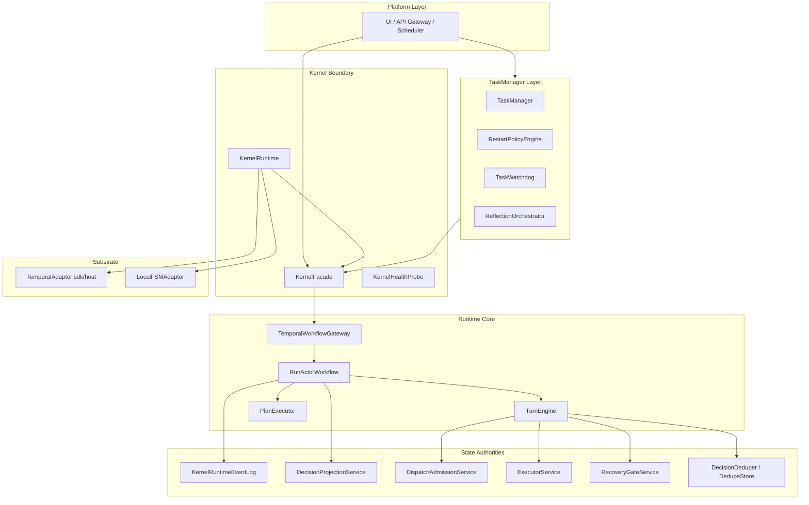
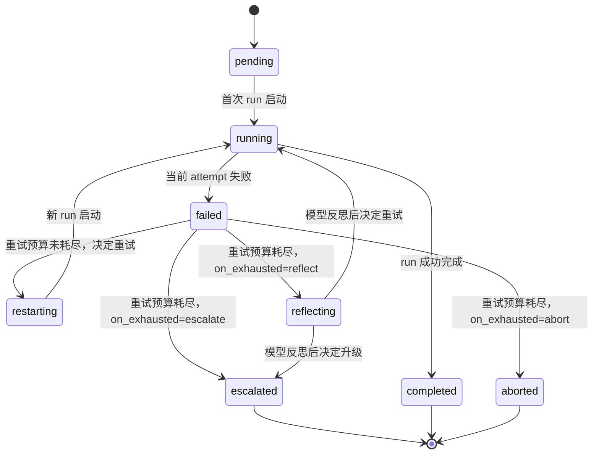
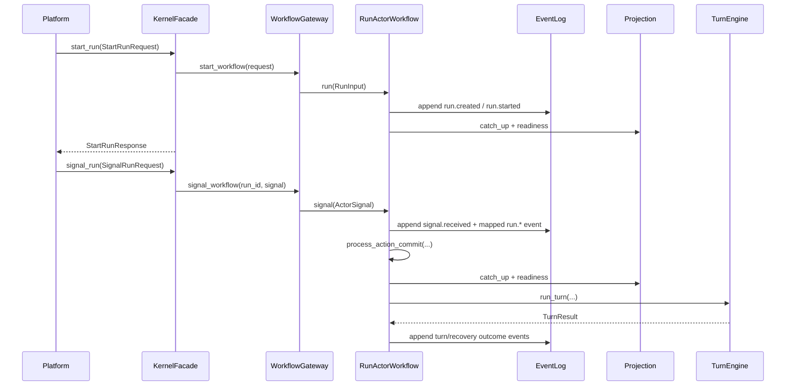
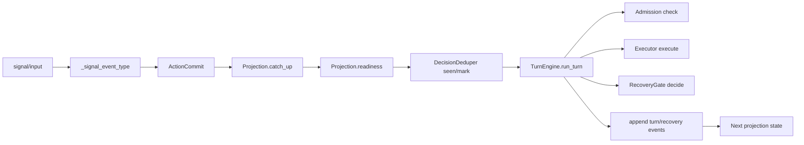
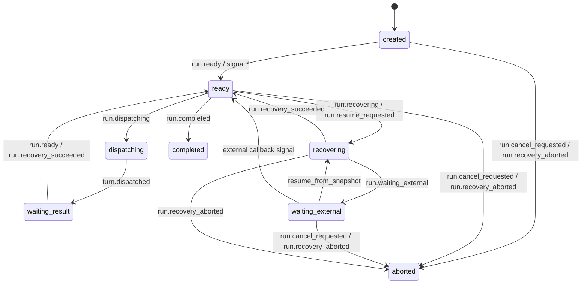

# ARCHITECTURE

本文档描述 `agent-kernel` 当前可执行实现的架构设计，重点覆盖：
- 设计逻辑如何演进到当前形态
- 分层职责和调用边界
- 核心状态机与调用关系
- 与规模化运行相关的约束与扩展点

阅读建议：
- 如果你是第一次接触这个仓库，先看第 1、2、4 节，建立整体心智模型。
- 如果你在做平台接入，重点看第 4、5、6、7 节。
- 如果你在做内核扩展，重点看第 3、6、8 节。

先记住一句话：
`agent-kernel` 的本质不是"执行器"，而是"带事件真相和恢复治理的 run 生命周期内核"。

## 1. 设计逻辑演进

### 1.0 为什么这个内核存在

普通的 agent 执行链在规模变大后，通常会遇到四类问题：
- 一旦进程退出，长任务状态丢失。
- 工具调用和内部状态混在一起，失败后难以判断是否已经产生副作用。
- 查询面和执行面耦合，平台很难稳定展示"当前到底进行到哪里"。
- 人工审批、外部回调、子任务并行等能力不断叠加后，逻辑迅速失控。

`agent-kernel` 的设计就是围绕这四类问题逐步收敛出来的。

### 1.1 演进目标

`agent-kernel` 的核心目标不是"封装一次模型调用"，而是提供一个可长期运行、可恢复、可治理的执行内核：
- 运行不丢（durable / restart-safe）
- 状态可重建（event -> projection）
- 副作用可控（admission + dedupe + recovery）
- 接口稳定（platform 只面向 facade）

### 1.2 演进阶段

1. 单次执行阶段（早期 PoC）
- 问题：执行链路与状态混在一起，失败后难以恢复。
- 改进方向：把生命周期、状态、执行、副作用治理拆开。

2. 权威拆分阶段（六权威）
- 引入六权威职责：`RunActor`、`EventLog`、`Projection`、`Admission`、`Executor`、`RecoveryGate`。
- 结果：事实（event）与视图（projection）分离，恢复路径可审计。

3. substrate 解耦阶段
- 将 Temporal 作为"可插拔执行底座"，通过 `TemporalWorkflowGateway` 抽象隔离 SDK 细节。
- 结果：同一套 kernel 逻辑可运行在 `Temporal(sdk/host)` 或 `LocalFSM`。

4. 协作增强阶段
- 增加 `plan_submitted` / `approval_submitted` / `speculation_committed`。
- 增加 TRACE 相关能力：branch/stage/human_gate/task_view。
- 结果：支持更复杂的人机协作与平台化观测。

## 2. 系统分层与依赖



分层约束：
- 平台层禁止直接调用 substrate 或 workflow。
- 业务读状态走 `Facade.query_*`，不直接读 event log。
- 生命周期推进只由 `RunActorWorkflow` 驱动。

可以把这些层理解成两条平行主线：
- 控制线：`Platform -> Facade -> Gateway -> RunActor`
- 执行线：`RunActor -> TurnEngine -> Admission/Executor/Recovery`

前者负责"谁能发起、何时推进"；后者负责"这一轮具体怎么执行、失败后怎么办"。

TaskManager 层位于 Platform 与 KernelFacade 之间，负责跨 run 的任务语义：一个任务可能对应多次 run 尝试，TaskManager 持有稳定的 task_id，并协调重试、反思、升级等决策。

## 2.1 核心术语表

| 术语 | 含义 | 为什么重要 |
|---|---|---|
| `run` | 内核管理的一个执行实例 | 所有生命周期、事件、查询都围绕 run 展开 |
| `task` | 跨 run 的语义任务单元 | task_id 稳定不变；一个 task 可对应多次 run 尝试 |
| `event` | append-only 的事实记录 | 用来回放和审计，不能随意修改 |
| `projection` | 从事件重建出的当前视图 | 平台读状态时看它，而不是读内部变量 |
| `signal` | 外部输入给 run 的触发消息 | signal 不是最终真相，通常会先映射为权威事件 |
| `turn` | 一次决策-准入-执行-恢复回合 | run 是长期的，turn 是 run 内的一轮 |
| `admission` | 执行前的准入检查 | 防止高风险副作用被直接放行 |
| `recovery` | 失败后的恢复决策 | 明确补偿、人工介入或终止策略 |
| `substrate` | 承载 run 的底座实现 | 当前支持 Temporal 和 LocalFSM |

## 3. 六权威职责模型

| 权威组件 | 角色 | 关键责任 | 代码位置 |
|---|---|---|---|
| RunActor | 生命周期权威 | 驱动 run 启动、信号处理、回合推进 | `agent_kernel/substrate/temporal/run_actor_workflow.py` |
| EventLog | 事实权威 | 追加不可变事件、提供回放基线 | `agent_kernel/kernel/minimal_runtime.py` |
| Projection | 视图权威 | 从事件重建 run 视图，提供 query/readiness | `agent_kernel/kernel/minimal_runtime.py` |
| Admission | 副作用准入权威 | 执行前策略检查与准入包络 | `agent_kernel/kernel/minimal_runtime.py` |
| Executor | 执行权威 | 执行动作（tool/mcp/...）并返回结果 | `agent_kernel/kernel/minimal_runtime.py` |
| RecoveryGate | 恢复权威 | 失败后恢复决策（补偿/人工/终止） | `agent_kernel/kernel/minimal_runtime.py` |

### 3.1 Peer 授权两层模型

Peer 信号授权（`agent_kernel/kernel/peer_auth.py`）支持两个层级：

| 层级 | 条件 | 机制 | 适用场景 |
|---|---|---|---|
| 生产层 | `CapabilitySnapshot.peer_run_bindings` 非空 | 查 snapshot 中的显式白名单（schema_version="2" 新增），hash 覆盖，不可变 | 多租户、A2A 握手、parent-child 委托 |
| PoC 回退层 | `peer_run_bindings` 为空 | 查 run projection 的 `active_child_runs` | PoC / 单进程部署 |

生产层的 `peer_run_bindings` 是 CapabilitySnapshot 的一部分，纳入 SHA256 hash；PoC 回退层的 `active_child_runs` 是可变 projection 状态，不具备多租户场景的密码学安全性。

## 3.2 TaskManager 层

TaskManager（`agent_kernel/kernel/task_manager/`）是位于 Run 之上的任务生命周期管理层。

### 核心设计：task vs run

一个 `task` 是语义目标单元，有稳定的 `task_id`，可能需要多次 run 尝试才能完成。每次尝试对应一个独立的 `TaskAttempt`，绑定一个 `run_id`。

```
task_id (稳定) ──► attempt_seq=1 ──► run_id=run-abc  (失败)
                ──► attempt_seq=2 ──► run_id=run-def  (失败)
                ──► attempt_seq=3 ──► run_id=run-ghi  (完成)
```

### TaskLifecycleState 状态机



状态说明：
- `pending`：任务已注册，尚未有 run 执行。
- `running`：有活跃 run 正在执行此任务的当前 attempt。
- `completed`：目标已达成，run 成功完成。
- `failed`：当前 attempt 失败，重试预算仍有余量。
- `restarting`：`RestartPolicyEngine` 决定重试，正在启动新 run。
- `reflecting`：重试预算耗尽，`ReflectionOrchestrator` 正在向模型发送反思请求。
- `escalated`：任务移交人工操作员。
- `aborted`：重试预算耗尽且未配置反思，任务终止。

### TaskManager 核心组件

| 组件 | 路径 | 职责 |
|---|---|---|
| `TaskRegistry` | `task_manager/registry.py` | 追踪 TaskDescriptor 和 TaskAttempt，提供 task → attempt 查询 |
| `RestartPolicyEngine` | `task_manager/restart_policy.py` | 判断失败后是重试、反思还是终止；基于 TaskRestartPolicy 配置 |
| `TaskWatchdog` | `task_manager/watchdog.py` | 检测心跳超时的僵尸任务（heartbeat_timeout_ms 驱动） |
| `ReflectionOrchestrator` | `task_manager/reflection_orchestrator.py` | 协调模型驱动恢复；当重试预算耗尽且 on_exhausted=reflect 时触发 |
| `ReflectionBridge` | `task_manager/reflection_bridge.py` | 构建 LLM 上下文（失败历史 + goal_description），供反思调用使用 |
| `TaskEventAppender` / `InMemoryTaskEventLog` | `task_manager/event_log.py` | 任务级事件日志，与 kernel EventLog 并行但独立 |

### 与六权威的关系

TaskManager 不属于六权威之一。它是在 Run 生命周期之上的协调层：
- 通过 `KernelFacade.register_task / get_task_status` 暴露给平台。
- 每次重试时通过 `KernelFacade.start_run` 新建 run，而不是修改已有 run 的状态。
- TaskManager 决策（重试/反思/升级）不写入 kernel EventLog，但可以写入独立的 task-level event log。

## 4. 核心调用关系

### 4.1 Run 启动与信号处理主链路



这条链路最关键的设计点是：
- 任何外部输入先进入 workflow，而不是直接改 projection。
- `RunActorWorkflow` 先写事件，再推进视图，保证"先有事实，再有状态"。
- `TurnEngine` 负责一轮执行闭环，但生命周期最终仍由 `RunActorWorkflow` 持有。

### 4.2 RunActor 内部依赖调用



这张图表达的是"一个 signal 不会直接变成一次工具调用"，中间至少要经过：
- projection catch-up：先确认当前 run 已经追平到哪个 offset。
- readiness 判断：当前状态是否允许继续推进。
- dedupe 判断：这一轮是否已经被处理过。
- admission / execution / recovery：真正的执行治理链。

### 4.3 信号到权威事件映射（关键片段）

`RunActorWorkflow` 中 `_SIGNAL_EVENT_TYPE_MAP` 将 transport signal 归一到权威事件：
- `resume_from_snapshot -> run.resume_requested`
- `cancel_requested -> run.cancel_requested`
- `timeout -> run.waiting_external`
- `hard_failure -> run.recovery_aborted`
- `plan_submitted -> run.plan_submitted`
- `approval_submitted -> run.approval_submitted`
- `speculation_committed -> run.speculation_committed`

## 5. 生命周期状态机

`RunLifecycleState` 当前值：
`created | ready | dispatching | waiting_result | waiting_external | recovering | completed | aborted`



状态机约束：
- `run.cancel_requested` 是权威生命周期事实，不是"仅通知"。
- `completed/aborted` 后不允许低优先级运行态事件覆盖。
- `projection` 是查询真相，事件是重建来源。

一个更容易理解的状态演进故事是：
1. `created`：run 刚被接受，还没准备好执行。
2. `ready`：可以进入下一轮调度。
3. `dispatching / waiting_result`：某个动作正在被发出或等待结果。
4. `waiting_external`：需要等外部世界，比如回调、审批、恢复输入。
5. `recovering`：内核正在处理失败后的恢复策略。
6. `completed / aborted`：run 进入终态，不再接受普通推进事件。

## 6. 接口边界与一致性约束

1. 入口边界
- 平台层只通过 `KernelFacade` 进入内核。
- 不直接使用 `Temporal` SDK 对 run 写入业务信号。

2. 一致性边界
- EventLog append-only，不允许原地修改历史。
- Projection 只能由事件回放推进。
- Recovery 决策必须走 `RecoveryGateService`。

3. 副作用边界
- 任何副作用先过 `Admission`。
- 幂等状态通过 `DecisionDeduper/DedupeStore` 跟踪。
- 失败后的处理必须形成 recovery 事件闭环。

为什么要把这些边界说得这么硬：
- 如果平台可以直接改状态，那么 event replay 就不再可信。
- 如果 executor 可以绕过 admission，那么高风险副作用无法被治理。
- 如果 recovery 不写事件，那么故障后的分析和重放会失真。

## 7. Substrate 选择与取舍

| 模式 | 配置 | 优势 | 限制 | 推荐场景 |
|---|---|---|---|---|
| Temporal SDK | `TemporalSubstrateConfig(mode="sdk")` | 外部集群、持久化与稳定性最佳 | 依赖外部 Temporal 基础设施 | 生产 |
| Temporal Host | `TemporalSubstrateConfig(mode="host")` | 单机可自举、便于本地/CI | 仍需 Temporal testing 依赖 | 开发/集成测试 |
| LocalFSM | `LocalSubstrateConfig(...)` | 轻量、无外部依赖 | 无 durable history、无跨进程隔离 | 单进程测试/嵌入式场景 |

## 8. 扩展面与规模化建议

### 8.1 可扩展点
- 类型注册：`action_type` / `plan_type` / `event_type` / `recovery_mode`
- 观测扩展：`ObservabilityHook`、event export
- 数据平面扩展：event log / dedupe / task view 的持久化后端

### 8.2 大规模工程落地建议

1. 生产优先使用 `Temporal(sdk)` + 持久化 event log。
2. 平台侧在启动时缓存 `KernelManifest`，做能力协商；注意 `trace_protocol_version` 和 `supported_trace_features` 可用于特性开关判断。
3. 统一约束 signal taxonomy，避免 ad-hoc signal 语义漂移。
4. 对 `task.*`、`human_gate.*`、`branch/stage` 事件建立监控面板。
5. 将"事件 schema 版本 + 回放校验"纳入发布门禁。
6. Peer 授权生产环境使用 schema_version="2" 的 `peer_run_bindings`，避免依赖 PoC 回退的 `active_child_runs`。

常见误区：
- 把 `signal` 当成最终状态：不对，signal 更像外部刺激，真正状态要看 event replay 后的 projection。
- 把 `LocalFSM` 当成生产默认选项：不合适，它适合本地测试和轻量嵌入，不提供跨进程 durability。
- 直接在平台代码里拼 run 状态：不建议，应该统一读取 facade/query 暴露的视图。

### 8.3 原子化 DedupeStore

`DedupeStore`（`agent_kernel/kernel/dedupe_store.py`）在 v6.4 引入了两项关键增强：

**新终态 `succeeded`**

完整状态转移路径：

```
reserved → dispatched → acknowledged → succeeded
                     └→ unknown_effect
```

`succeeded` 是"结果已确认、可收集执行证据"的终态，与 `acknowledged`（外部已回执）语义区分明确。

**原子方法 `reserve_and_dispatch`**

传统两步写法存在非原子窗口：

```python
# 旧模式：reserve 后、mark_dispatched 前的窗口内若进程崩溃，状态停留在 reserved
store.reserve(envelope)
# ... 窗口 ...
store.mark_dispatched(key)
```

原子方法直接跳过 `reserved` 中间态，一次写入进入 `dispatched`：

```python
# 新模式：reserve_and_dispatch 是原子操作，消除竞争窗口
result = store.reserve_and_dispatch(envelope, peer_operation_id=...)
if not result.accepted:
    # 重复 key，跳过分发
    ...
```

`InMemoryDedupeStore` 和 `SQLiteDedupeStore` 均实现完整协议，包含 `reserve_and_dispatch` 和 `mark_succeeded`。
