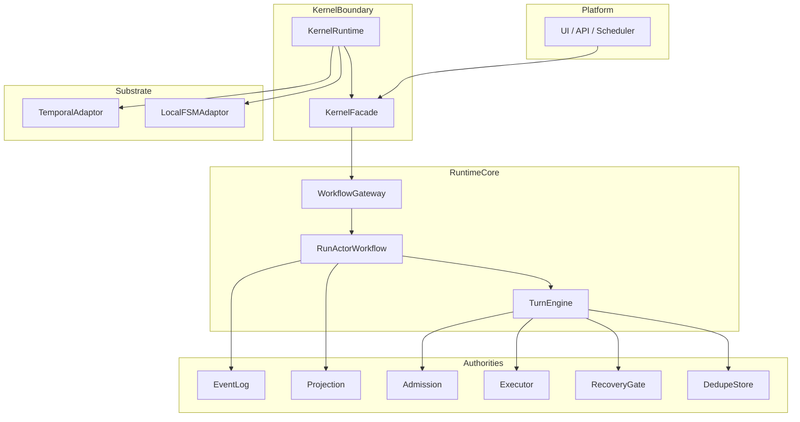
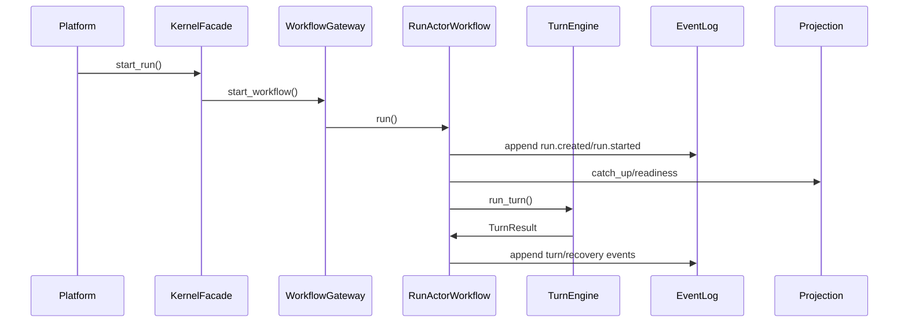

# ARCHITECTURE

本文档描述 `agent-kernel` 当前实现的可执行架构，重点覆盖：

- 分层职责与边界
- 关键调用链路
- 生命周期与状态推进
- 事件一致性和恢复治理
- 可扩展点与工程落地建议

## 1. 架构分层

边界约束：

- 平台层不直接依赖 workflow/substrate 细节。
- 生命周期推进由 `RunActorWorkflow` 统一驱动。
- 查询优先走 projection，不直接拼装事件内部状态。

## 2. 核心主链路

### 2.1 启动链路

1. 平台调用 `KernelRuntime.start(...)` 初始化 runtime + substrate。
2. 平台通过 `KernelFacade.start_run(...)` 发起 run。
3. gateway 将请求映射到 workflow 执行单元。

### 2.2 执行链路

### 2.3 信号链路

1. 平台调用 `signal_run(...)`。
2. workflow 将信号映射为标准事件类型。
3. 事件写入后推进 projection，再触发下一轮决策。

## 3. 状态模型

`RunLifecycleState`（当前实现）：

- `created`
- `ready`
- `dispatching`
- `waiting_result`
- `waiting_external`
- `recovering`
- `completed`
- `aborted`

状态约束：

- `completed` / `aborted` 是终态，不允许被低优先级事件覆盖。
- 外部 signal 不直接等于状态，必须通过事件映射和回放生效。

## 4. 一致性与可恢复性设计

### 4.1 事件与投影双轨

- EventLog 是 append-only 事实源。
- Projection 是读模型，可由事件重建。
- 恢复、审计、重放依赖事件链完整性。

### 4.2 副作用治理

- admission：执行前策略检查。
- dedupe：幂等键防重放。
- recovery gate：失败后的补偿、重试、人工介入决策。

### 4.3 存储后端

- In-memory：本地开发/轻量场景。
- SQLite：本地持久化与低成本落地。
- PostgreSQL（已支持路径）：规模化持久化能力。

## 5. Substrate 选择策略

- `TemporalSubstrateConfig(mode="sdk")`：生产推荐。
- `TemporalSubstrateConfig(mode="host")`：本地/CI。
- `LocalSubstrateConfig`：进程内模式，适合测试与快速迭代。

## 6. 扩展点

- Action / Event / Recovery 模式注册器
- Observability hook 与 event export
- Recovery 补偿处理器注册
- Task manager 相关任务生命周期扩展

## 7. 工程建议

1. 生产环境优先 Temporal(sdk) + 持久化 EventLog。
2. 平台接入统一通过 `KernelFacade`，避免旁路写状态。
3. 对关键事件类型建立监控仪表盘（run/task/branch/stage/human_gate）。
4. 发布门禁加入事件回放与 schema 兼容性校验。
