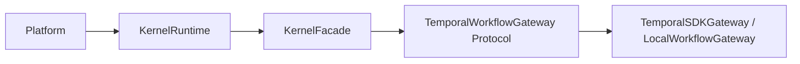

# INTERFACES

本文档是 `agent-kernel` 当前实现的接口契约说明，按“调用边界 -> API 簇 -> DTO -> 信号/事件语义”组织。

阅读建议：
- 如果你只想“把系统接起来”，先看第 2、3、7 节。
- 如果你在补平台能力发现或治理面板，重点看第 3.3、4、6、8 节。
- 如果你在排查状态异常，先回到 [ARCHITECTURE.md](./ARCHITECTURE.md) 看 lifecycle 和调用链。

## 1. 接口边界总览



边界规则：
- 平台只依赖 `KernelRuntime` 与 `KernelFacade`。
- `TemporalWorkflowGateway` 是 substrate 抽象协议，不向平台暴露 Temporal SDK 对象。
- DTO 以 `agent_kernel/kernel/contracts.py` 为准。

一个简单判断原则：
- 平台代码：优先调 facade。
- substrate 适配代码：实现 gateway。
- 内核代码：围绕 contracts 和 run actor 演进。

## 2. 入口接口

## 2.0 接入方最常用的三个入口

多数平台接入只需要先掌握这三个点：
- `KernelRuntime.start(...)`：把内核和 substrate 启起来。
- `kernel.facade.start_run(...)`：启动一个 run。
- `kernel.facade.query_run(...)`：读取当前 run 的标准状态视图。

剩下的大多数能力，都是围绕这三步扩展出来的。

### 2.1 KernelRuntime

路径：`agent_kernel/runtime/kernel_runtime.py`

| 接口 | 输入 | 输出 | 语义 |
|---|---|---|---|
| `KernelRuntime.start(config, temporal_client=None)` | `KernelRuntimeConfig` | `KernelRuntime` | 统一启动 kernel + substrate |
| `runtime.stop()` | - | `None` | 优雅停机 |
| `runtime.facade` | - | `KernelFacade` | 平台主入口 |
| `runtime.gateway` | - | `TemporalWorkflowGateway` | substrate 网关（一般平台不直接使用） |
| `runtime.health` | - | `KernelHealthProbe` | 健康探针对象 |

`KernelRuntimeConfig` 关键字段：
- substrate 与运行模式：`substrate` (`TemporalSubstrateConfig` 或 `LocalSubstrateConfig`)
- Temporal 兼容字段：`temporal_address`、`temporal_namespace`、`task_queue`、`workflow_id_prefix`
- 运行治理：`strict_mode_enabled`
- 存储后端：`event_log_backend`、`sqlite_database_path`
- 观测扩展：`observability_hook`、`event_export_port`、`export_timeout_ms`

配置选择建议：
- 想接生产环境：优先显式传 `TemporalSubstrateConfig(mode="sdk")`。
- 想本地联调：可用 `TemporalSubstrateConfig(mode="host")`。
- 想跑轻量测试：用 `LocalSubstrateConfig(...)`。

### 2.2 Substrate Config

| 类型 | 字段 | 说明 |
|---|---|---|
| `TemporalSubstrateConfig` | `mode` = `"sdk" | "host"` | `sdk` 连接外部集群，`host` 启动本地 dev server |
|  | `address` / `namespace` / `task_queue` | Temporal 连接与队列 |
|  | `workflow_id_prefix` / `strict_mode_enabled` | workflow id 与严格模式 |
|  | `host_port` / `host_db_filename` / `host_ui_port` | host 模式配置 |
| `LocalSubstrateConfig` | `workflow_id_prefix` / `strict_mode_enabled` | 纯 in-process 本地 FSM 模式 |

## 3. KernelFacade API

路径：`agent_kernel/adapters/facade/kernel_facade.py`

### 3.1 Run 生命周期 API

| 方法 | 请求 | 响应 | 说明 |
|---|---|---|---|
| `start_run` | `StartRunRequest` | `StartRunResponse` | 创建 run，返回 run id 与初始状态 |
| `signal_run` | `SignalRunRequest` | `None` | 向 run 注入统一 signal |
| `stream_run_events` | `run_id` + `include_derived_diagnostic?` | `AsyncGenerator[RuntimeEvent]` | 流式观察 run 事件 |
| `cancel_run` | `CancelRunRequest` | `None` | 先写 `cancel_requested` 信号，再调用 cancel_workflow |
| `resume_run` | `ResumeRunRequest` | `None` | 从 checkpoint 恢复，转为 `resume_from_snapshot` 信号 |
| `escalate_recovery` | `run_id, reason, caused_by?` | `None` | 人工恢复升级信号 |
| `query_run` | `QueryRunRequest` | `QueryRunResponse` | 查询 run 投影视图 |
| `query_run_dashboard` | `run_id` | `QueryRunDashboardResponse` | dashboard 友好聚合视图 |

这组 API 是平台最核心的一层：
- `start_run` 负责创建执行实例。
- `signal_run` / `cancel_run` / `resume_run` 负责外部干预。
- `query_run` / `query_run_dashboard` 负责稳定读取状态。
- `stream_run_events` 负责观测事件流，而不是替代 query。

### 3.2 子运行与计划协作 API

| 方法 | 请求 | 响应 | 说明 |
|---|---|---|---|
| `spawn_child_run` | `SpawnChildRunRequest` | `SpawnChildRunResponse` | 创建 child run，并向 parent 写 `child_spawned` 信号 |
| `submit_plan` | `run_id, ExecutionPlan` | `PlanSubmissionResponse` | 校验 plan type 后发 `plan_submitted` |
| `submit_approval` | `ApprovalRequest` | `None` | 人工审批信号，带本实例防重 |
| `commit_speculation` | `run_id, winner_candidate_id` | `None` | 提交 speculative winner |

适用场景：
- `spawn_child_run`：把一个大任务拆成独立子 run。
- `submit_plan`：平台或上层 agent 已经生成显式执行计划。
- `submit_approval`：某个动作必须经过人工确认。
- `commit_speculation`：多候选方案并行跑完后，选定赢家。

### 3.3 健康与能力 API

| 方法 | 请求 | 响应 | 说明 |
|---|---|---|---|
| `get_manifest` | - | `KernelManifest` | 返回内核能力快照（plan/action/event/recovery/trace） |
| `get_health` | - | `dict` | liveness |
| `get_health_readiness` | - | `dict` | readiness |

建议平台启动时做两件事：
- 先调一次 `get_manifest()`，把能力缓存下来。
- 再接入健康检查，把 `liveness` 和 `readiness` 分开看。

### 3.4 Task / Trace API

| 方法 | 请求 | 响应 | 说明 |
|---|---|---|---|
| `register_task` | `TaskDescriptor` | `None` | 注册任务 |
| `get_task_status` | `task_id` | `TaskHealthStatus \| None` | 查询任务健康 |
| `list_session_tasks` | `session_id` | `list[TaskDescriptor]` | 查询会话任务 |
| `query_trace_runtime` | `run_id` | `TraceRuntimeView` | 聚合 run/branch/stage/review 状态 |
| `record_task_view` | `TaskViewRecord` | `str` | 记录 task_view |
| `get_task_view_record` | `task_view_id` | `TaskViewRecord \| None` | 按 id 查 task_view |
| `get_task_view_by_decision` | `run_id, decision_ref` | `TaskViewRecord \| None` | 按 decision_ref 查 task_view |
| `bind_task_view_to_decision` | `task_view_id, decision_ref` | `None` | 迟绑定 decision |
| `open_stage` | `stage_id, run_id, branch_id?` | `None` | 打开 stage 并发 `stage_opened` |
| `mark_stage_state` | `run_id, stage_id, new_state, failure_code?` | `None` | 更新 stage 状态并发信号 |
| `open_branch` | `OpenBranchRequest` | `None` | 打开 branch |
| `mark_branch_state` | `BranchStateUpdateRequest` | `None` | 更新 branch 状态 |
| `open_human_gate` | `HumanGateRequest` | `None` | 打开人工 gate |
| `get_action_state` | `dispatch_idempotency_key` | `str \| None` | 查询幂等状态机状态 |

这组 API 不是 run 最小闭环所必需，但对平台化很重要：
- Task API 偏任务治理。
- Trace API 偏运行过程可视化。
- `get_action_state` 偏执行副作用的幂等诊断。

## 4. Gateway 协议契约

`TemporalWorkflowGateway`（`contracts.py`）定义 substrate 必须实现的方法：

| 方法 | 输入 | 输出 |
|---|---|---|
| `start_workflow` | `StartRunRequest` | `dict[str, str]` |
| `signal_workflow` | `run_id, SignalRunRequest` | `None` |
| `cancel_workflow` | `run_id, reason` | `None` |
| `query_projection` | `run_id` | `RunProjection` |
| `start_child_workflow` | `parent_run_id, SpawnChildRunRequest` | `dict[str, str]` |
| `stream_run_events` | `run_id` | `AsyncIterator[RuntimeEvent]` |

这层协议的意义是：
- 向上屏蔽 Temporal SDK 细节。
- 向下允许 Temporal / LocalFSM 以相同语义实现。
- 保证 facade 可以在不同 substrate 之间保持稳定。

## 5. 核心 DTO 族

路径：`agent_kernel/kernel/contracts.py`

### 5.1 Run DTO
- `StartRunRequest` / `StartRunResponse`
- `SignalRunRequest`
- `CancelRunRequest`
- `ResumeRunRequest`
- `QueryRunRequest` / `QueryRunResponse`
- `QueryRunDashboardResponse`
- `SpawnChildRunRequest` / `SpawnChildRunResponse`

### 5.2 Plan DTO
- `SequentialPlan`
- `ParallelPlan`
- `ConditionalPlan`
- `DependencyGraph`
- `SpeculativePlan`
- `ExecutionPlan = SequentialPlan | ParallelPlan | ConditionalPlan | DependencyGraph | SpeculativePlan`

### 5.3 协作与能力 DTO
- `ApprovalRequest`
- `PlanSubmissionResponse`
- `KernelManifest`

### 5.4 Trace / Task DTO
- `TraceRuntimeView` / `TraceBranchView` / `TraceStageView`
- `TaskViewRecord`
- `OpenBranchRequest`
- `BranchStateUpdateRequest`
- `HumanGateRequest`

### 5.5 Lifecycle 状态字面量

`RunLifecycleState`：
- `created`
- `ready`
- `dispatching`
- `waiting_result`
- `waiting_external`
- `recovering`
- `completed`
- `aborted`

## 6. Signal 与事件映射

`RunActorWorkflow._SIGNAL_EVENT_TYPE_MAP` 关键映射：

| Signal | 权威事件 |
|---|---|
| `resume_from_snapshot` | `run.resume_requested` |
| `cancel_requested` | `run.cancel_requested` |
| `hard_failure` | `run.recovery_aborted` |
| `timeout` | `run.waiting_external` |
| `recovery_succeeded` | `run.recovery_succeeded` |
| `recovery_aborted` | `run.recovery_aborted` |
| `plan_submitted` | `run.plan_submitted` |
| `approval_submitted` | `run.approval_submitted` |
| `speculation_committed` | `run.speculation_committed` |

未显式映射的 signal 统一落为 `signal.<signal_type>`。

理解这张映射表时要注意：
- signal 是入口语义。
- event 是权威语义。
- projection 是查询语义。

也就是说，平台看到的“我发了一个 signal”并不等于“run 状态已经立即改变”，真正可读状态以 projection 为准。

## 7. 典型调用序列

### 7.1 最小 run 生命周期

```python
started = await kernel.facade.start_run(
    StartRunRequest(initiator="user", run_kind="task", input_json={"run_id": "run-1"})
)

await kernel.facade.signal_run(
    SignalRunRequest(run_id=started.run_id, signal_type="resume_from_snapshot")
)

view = await kernel.facade.query_run(QueryRunRequest(run_id=started.run_id))
```

这一段表达的最小接入闭环是：
- 启动一个 run。
- 发送一个 signal。
- 查询 run 当前状态。

### 7.2 计划执行与人工审批

```python
resp = await kernel.facade.submit_plan(started.run_id, plan)

await kernel.facade.open_human_gate(
    HumanGateRequest(
        run_id=started.run_id,
        gate_ref="gate-1",
        gate_type="approval",
        trigger_reason="high_risk_effect",
        trigger_source="policy",
    )
)

await kernel.facade.submit_approval(
    ApprovalRequest(
        run_id=started.run_id,
        approval_ref="gate-1",
        approved=True,
        reviewer_id="reviewer-A",
    )
)
```

这一段适合更复杂的平台流程：
- 平台先提交计划。
- 内核在某一步打开人工 gate。
- 审批系统再回写 approval。

## 8. 兼容性约束

1. 平台不要绕过 `KernelFacade` 直接写 substrate。
2. 事件是事实源，查询以 projection 为准。
3. 自定义 `action_type/plan_type/event_type/recovery_mode` 应通过 registry 注册，避免语义漂移。
4. `get_manifest()` 应在平台启动阶段缓存，作为能力协商依据。

一个实操建议：
- 如果你不确定某个场景应该“读 query 还是读 event stream”，大多数业务页面先读 `query_*`，观测和调试再接 `stream_run_events(...)`。
