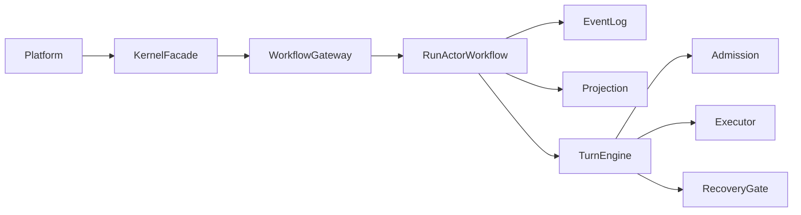

# agent-kernel

`agent-kernel` 是一个面向长生命周期任务的智能体内核，核心目标是把运行状态、事件事实、副作用治理和恢复决策做成可追踪、可恢复、可审计的基础层。

它不负责业务编排 UI，也不直接等同于工具执行器，而是位于平台层与执行层之间，统一治理 run 生命周期。

## 定位与边界

- 平台层：负责接入请求、业务编排、展示和运营。
- 内核层（本仓库）：负责 run 生命周期推进、事件记录、投影读取、副作用治理、恢复策略。
- 执行层：负责工具、MCP、外部服务、子智能体执行。

## 当前版本

- Kernel version: `0.2.0`
- Protocol version: `1.0.0`
- Python: `>=3.12`

## 目录概览

```text
agent_kernel/
  adapters/           # 平台/上层集成适配
  kernel/             # 核心协议、turn engine、recovery、persistence
  runtime/            # KernelRuntime 及健康检查
  service/            # HTTP 服务封装
  skills/             # 技能运行时契约
  substrate/          # Temporal 与本地执行 substrate
python_tests/         # Python 测试
docs/                 # 设计说明与专项文档
```

## 核心架构主链路



关键原则：

- 单入口：平台只通过 `KernelFacade` 与内核交互。
- 双轨真相：事件日志是事实源，Projection 是查询视图。
- 副作用先治理：执行前必须通过 admission + dedupe。
- 失败显式恢复：异常必须经过 recovery gate 决策。

## 快速启动

```bash
pip install -e ".[dev]"
```

```python
from agent_kernel.runtime.kernel_runtime import KernelRuntime, KernelRuntimeConfig
from agent_kernel.kernel.contracts import StartRunRequest


async def main() -> None:
    async with await KernelRuntime.start(KernelRuntimeConfig()) as kernel:
        started = await kernel.facade.start_run(
            StartRunRequest(
                initiator="user",
                run_kind="task",
                input_json={"run_id": "run-demo-1"},
            )
        )
        print(started.run_id, started.lifecycle_state)
```

## 开发与质量门禁

```bash
python -m ruff check .
python -m pytest -q python_tests/agent_kernel
```

如需严格检查 docstring（Google 风格）：

```bash
python -m ruff check agent_kernel --select D
```

## 文档导航

- [ARCHITECTURE.md](./ARCHITECTURE.md): 架构分层、调用链路、状态模型
- [INTERFACES.md](./INTERFACES.md): 接口契约与 DTO（当前文件存在编码问题，建议后续统一重写）
- [QUICKSTART.md](./QUICKSTART.md): 接入和最小可运行示例
- [CODING_STANDARDS.md](./CODING_STANDARDS.md): 代码与注释规范

## Substrate 模式

- `TemporalSubstrateConfig(mode="sdk")`: 连接外部 Temporal 集群（生产推荐）
- `TemporalSubstrateConfig(mode="host")`: 启动本地内嵌 Temporal dev server（开发/CI）
- `LocalSubstrateConfig(...)`: 纯进程内执行模式（轻量测试/本地调试）
