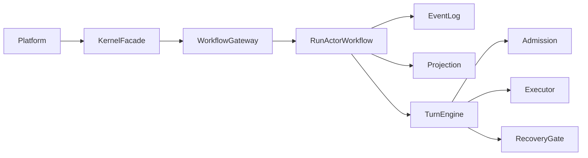

# agent-kernel

`agent-kernel` 是一个面向长期任务执行的智能体内核，强调可恢复、可观测、可治理。

它不是提示词编排层，而是平台与执行底座之间的内核层，负责：
- run 生命周期权威推进
- 事件事实（append-only）与投影视图分离
- 副作用准入与幂等治理
- 多 substrate（Temporal / LocalFSM）统一抽象

如果把一个智能体系统拆成三层，可以这样理解：
- 平台层：接收用户请求、展示界面、编排业务流程。
- 内核层：保证 run 如何启动、推进、恢复、终止，并把事实和视图管理清楚。
- 执行层：真正去调工具、MCP、子智能体、外部系统。

`agent-kernel` 处在中间这一层，解决的是“长期运行任务如何不乱、不丢、可追踪”。

## 1. 版本与范围

- Kernel 版本：`0.2.0`
- 接口协议：`1.0.0`
- Python：`>=3.14`
- 文档刷新日期：`2026-04-05`

## 2. 架构一览



上图可以按一条主线阅读：
- 平台只和 `KernelFacade` 说话。
- facade 通过 workflow gateway 把请求送进 `RunActorWorkflow`。
- `RunActorWorkflow` 负责推进生命周期，同时把执行决策交给 `TurnEngine`。
- `TurnEngine` 再分别调用准入、执行、恢复等权威组件。

设计原则：
- 单入口：平台只通过 `KernelFacade` 调用内核。
- 双轨真相：事件是事实来源，projection 是查询视图。
- 执行前治理：任何副作用先经过 admission 与 dedupe。
- 恢复显式化：失败后必须经过 `RecoveryGate` 决策。

如果只记三件事，可以记这三条：
- 写入侧看事件：所有重要变化都先变成 event。
- 读取侧看 projection：平台查询时看的是投影视图，不是内部临时状态。
- 执行侧先治理：任何真正的外部副作用都要先过 admission、dedupe、recovery。

## 3. 核心能力

- 六权威模型：`RunActor` / `EventLog` / `Projection` / `Admission` / `Executor` / `RecoveryGate`
- 五类计划：`Sequential` / `Parallel` / `Conditional` / `DependencyGraph` / `Speculative`
- 人机协作：`approval_submitted`、`human_gate_opened`、`task_view`
- 运行健康：liveness/readiness 探针
- 观测能力：事件流、trace runtime view、task 生命周期事件

## 4. 快速启动

安装：

```bash
pip install -e ".[dev]"
```

最小示例：

```python
from agent_kernel.runtime.kernel_runtime import KernelRuntime, KernelRuntimeConfig
from agent_kernel.kernel.contracts import StartRunRequest

async with await KernelRuntime.start(KernelRuntimeConfig()) as kernel:
    started = await kernel.facade.start_run(
        StartRunRequest(
            initiator="user",
            run_kind="task",
            input_json={"run_id": "run-demo-1"},
        )
    )
    print(started.run_id, started.lifecycle_state)
```

完整上手流程见 [QUICKSTART.md](./QUICKSTART.md)。

## 5. 文档导航

- 架构设计与调用关系图：[ARCHITECTURE.md](./ARCHITECTURE.md)
- 接口契约与 DTO：[INTERFACES.md](./INTERFACES.md)
- 接入与使用示例：[QUICKSTART.md](./QUICKSTART.md)
- 缺陷台账（规模化修复基线）：[KERNEL_SCALE_DEFECT_LEDGER.md](./KERNEL_SCALE_DEFECT_LEDGER.md)

建议阅读顺序：
1. 先看 [README.md](./README.md)，建立整体定位。
2. 再看 [QUICKSTART.md](./QUICKSTART.md)，知道平台实际怎么接。
3. 然后看 [ARCHITECTURE.md](./ARCHITECTURE.md)，理解为什么这样设计。
4. 最后查 [INTERFACES.md](./INTERFACES.md)，按接口和 DTO 精确对接。

## 6. Substrate 模式

- `TemporalSubstrateConfig(mode="sdk")`：连接外部 Temporal 集群（生产推荐）
- `TemporalSubstrateConfig(mode="host")`：本地内嵌 Temporal dev server（开发/CI）
- `LocalSubstrateConfig(...)`：纯 in-process 模式（轻量测试/嵌入）

## 7. 质量检查

```bash
python -m ruff check .
python -m pytest -q python_tests/agent_kernel
```

适合这个项目的典型使用场景：
- 需要把一次任务拆成多个回合执行，并且中间可能等待外部回调或人工审批。
- 需要在工具调用失败后做显式恢复，而不是简单重试。
- 需要在平台侧追踪 run、task、branch、stage 的完整生命周期。
