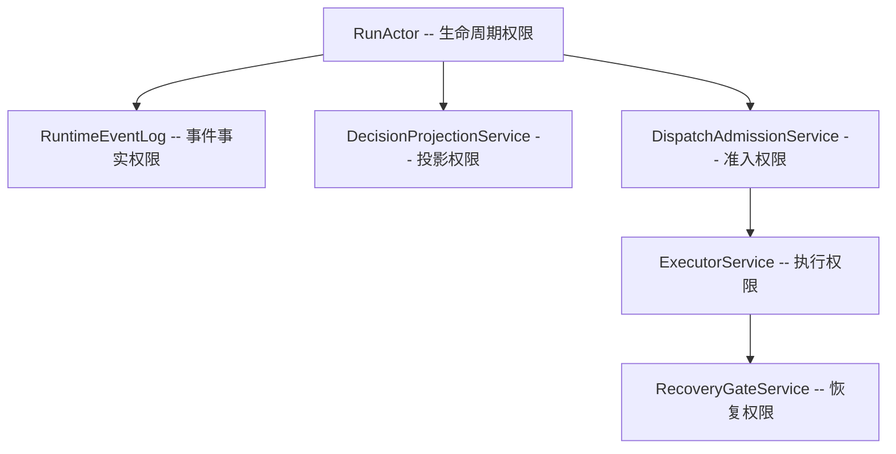
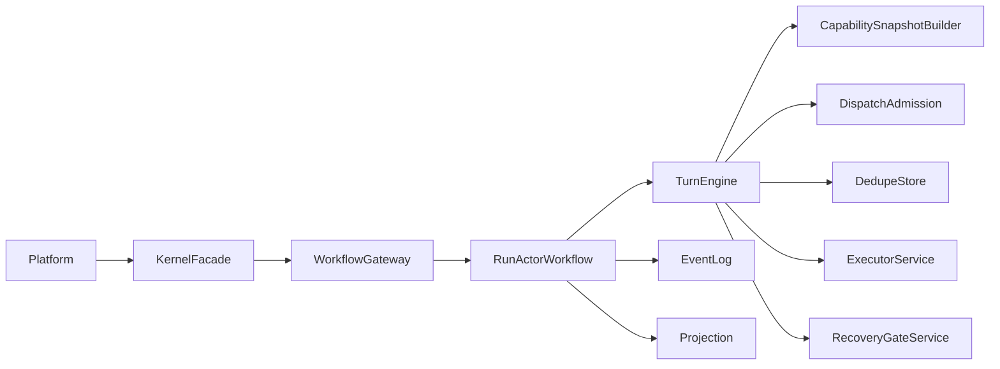

# agent-kernel

面向长生命周期任务的智能体内核 -- 统一治理 run 生命周期、事件事实、副作用管控与失败恢复。

## 定位与边界

- **平台层**：负责接入请求、业务编排、展示和运营。平台通过 `KernelFacade` 与内核交互，不直接访问内部服务。
- **内核层（本仓库）**：负责 run 生命周期推进、事件记录、投影读取、副作用治理、恢复策略。内核不保留业务逻辑，不编排计划 -- Phase 4 已将 `PlanExecutor` 和 Plan 类型全部移至上层。
- **执行层**：负责工具、MCP、外部服务、子智能体执行。内核仅通过 `ExecutorService` 做 dispatch，不控制执行细节。

## 当前版本

| 项目 | 值 |
|------|------|
| Kernel version | `0.2.0` |
| Protocol version | `1.0.0` |
| Python | `>=3.12` |
| 构建工具 | hatchling |
| Temporal Python SDK | `==1.24.0`（通过 git subtree 供应商化至 `external/temporal-sdk-python`） |
| Temporal Server | `>=1.20`（Docker Compose 固定：`1.25.2`） |

## 目录概览

```text
agent_kernel/
  adapters/
    facade/kernel_facade.py                  # 唯一平台入口 (KernelFacade)
    facade/workflow_gateway_adapter.py       # 信号 API 兼容适配器
    agent_core/                              # AgentCore 适配器 (context/checkpoint/runner/session/tool)
  kernel/
    contracts.py                             # 全部 DTO 与 Protocol 契约
    turn_engine.py                           # FSM 状态机核心
    minimal_runtime.py                       # 内存实现 (PoC/测试)
    capability_snapshot.py                   # SHA256 快照构建器
    capability_snapshot_resolver.py
    dedupe_store.py                          # 至多一次分发状态机
    event_registry.py                        # 25+ 内核事件类型目录
    action_type_registry.py                  # action_type 判别器注册
    failure_code_registry.py                 # 失败码注册表
    failure_evidence.py                      # 失败证据构建
    failure_mappings.py                      # 失败码到恢复模式映射
    idempotency_key_policy.py                # 幂等键策略
    peer_auth.py                             # 对等信号鉴权
    replay_fidelity.py                       # 重放保真度校验
    branch_monitor.py                        # 分支监控
    admission/                               # 生产准入服务
      snapshot_driven_admission.py           # SnapshotDrivenAdmissionService (5-规则流水线)
      tenant_policy.py                       # TenantPolicyResolver
    cognitive/                               # LLM 推理网关与脚本运行时
      llm_gateway_anthropic.py               # AnthropicLLMGateway
      llm_gateway_openai.py                  # OpenAILLMGateway
      script_runtime_subprocess.py           # SubprocessScriptRuntime
    persistence/                             # PostgreSQL / SQLite 持久化实现
      sqlite_decision_deduper.py             # SQLiteDecisionDeduper (WAL 模式)
    recovery/                                # 恢复决策 (planner/gate/circuit_breaker)
    task_manager/                            # 任务注册、健康监控
  runtime/
    bundle.py                                # AgentKernelRuntimeBundle 组装
    health.py                                # K8s 存活/就绪探针
    heartbeat.py                             # 超时看门狗
    metrics.py                               # 指标采集 (KernelMetricsCollector)
    observability_hooks.py                   # 可观测性钩子协议
    otel_export.py                           # OpenTelemetry 导出
    drain_coordinator.py                     # 优雅排空协调器
    kernel_runtime.py                        # KernelRuntime 组装 (遗留, 不推荐直接使用)
  service/
    http_server.py                           # Starlette HTTP 服务, create_app / create_app_temporal
    auth_middleware.py                       # Bearer-token 认证中间件
    openapi.py                               # OpenAPI 规范生成
    serialization.py                         # 请求/响应序列化
  skills/                                    # 技能运行时契约
  substrate/
    local/adaptor.py                         # 纯进程内执行 (LocalWorkflowGateway)
    temporal/                                # Temporal workflow / worker / activity
  config.py                                  # KernelConfig -- 集中配置
  testing.py                                 # 测试工具 re-export
  worker_main.py                             # 独立 Temporal worker CLI
python_tests/                                # 全部测试
docs/                                        # 设计文档
scripts/                                     # 工具脚本
  check_prod_safety.py                       # 生产安全扫描脚本
docker-compose.yml                           # 一键本地栈 (Temporal + kernel)
```

## 架构概览

### 六权限模型

内核严格执行六权限不可绕过原则：



### 核心数据流



关键原则：

- **单入口**：平台只通过 `KernelFacade` 与内核交互。
- **双轨真相**：事件日志是事实源，Projection 是查询视图。
- **副作用先治理**：执行前必须通过 admission + dedupe。
- **失败显式恢复**：异常必须经过 recovery gate 决策。

## 快速启动

### Docker Compose（最简路径）

```bash
# 启动 Temporal + kernel（含 HTTP 服务和 worker）
docker compose up --build

# 确认就绪
curl http://localhost:8400/health/liveness
curl http://localhost:8400/manifest
```

`docker-compose.yml` 包含两个服务：
- `temporal` — `temporalio/auto-setup:latest`，SQLite 后端，无需外部数据库
- `kernel` — HTTP API + Temporal worker 合一容器，挂载 `kernel-data` volume

### CLI 命令（已安装包）

```bash
pip install -e ".[dev]"

# 启动 HTTP 服务（内置 Temporal worker lifespan）
agent-kernel-server

# 独立 Temporal worker（从环境变量读取配置）
agent-kernel-worker
```

两个入口均从环境变量读取 `KernelConfig`（见配置章节）。`agent-kernel-server` 使用 `create_app_temporal()` 工厂，在同一进程内同时启动 HTTP 服务和 Temporal worker。

### 代码嵌入方式（Temporal 连接）

```python
from temporalio.client import Client
from agent_kernel.runtime.bundle import (
    AgentKernelRuntimeBundle,
    RuntimeEventLogConfig,
    RuntimeDecisionDedupeConfig,
    RuntimeProductionSafetyConfig,
)

temporal_client = await Client.connect("localhost:7233")

bundle = AgentKernelRuntimeBundle.build_minimal_complete(
    temporal_client=temporal_client,
    event_log_config=RuntimeEventLogConfig(backend="sqlite", sqlite_database_path="/data/events.db"),
    decision_deduper_config=RuntimeDecisionDedupeConfig(backend="sqlite", sqlite_database_path="/data/dedup.db"),
    production_safety_config=RuntimeProductionSafetyConfig(enabled=True, environment="prod"),
)

# bundle.facade 是 KernelFacade，bundle.gateway 是 TemporalSDKWorkflowGateway
```

### 纯进程内方式（开发/测试）

```python
from agent_kernel.adapters.facade.kernel_facade import KernelFacade
from agent_kernel.kernel.contracts import StartRunRequest
from agent_kernel.substrate.local.adaptor import LocalWorkflowGateway
from agent_kernel.substrate.temporal.run_actor_workflow import (
    RunActorDependencyBundle,
    RunActorStrictModeConfig,
)
from agent_kernel.testing import (
    AsyncExecutorService,
    InMemoryDecisionDeduper,
    InMemoryDecisionProjectionService,
    InMemoryDedupeStore,
    InMemoryKernelRuntimeEventLog,
    StaticDispatchAdmissionService,
    StaticRecoveryGateService,
)

event_log = InMemoryKernelRuntimeEventLog()
deps = RunActorDependencyBundle(
    event_log=event_log,
    projection=InMemoryDecisionProjectionService(event_log),
    admission=StaticDispatchAdmissionService(),
    executor=AsyncExecutorService(),
    recovery=StaticRecoveryGateService(),
    deduper=InMemoryDecisionDeduper(),
    dedupe_store=InMemoryDedupeStore(),
    strict_mode=RunActorStrictModeConfig(enabled=False),
)
gateway = LocalWorkflowGateway(deps)
facade = KernelFacade(workflow_gateway=gateway)

resp = await facade.start_run(
    StartRunRequest(
        initiator="user",
        run_kind="task",
        input_json={"run_id": "run-demo-1"},
    )
)
print(resp.run_id, resp.lifecycle_state)
```

### 测试工具

`agent_kernel.testing` 导出全部内存实现，用于下游集成测试：

```python
from agent_kernel.testing import (
    AsyncExecutorService,
    InMemoryDecisionDeduper,
    InMemoryDecisionProjectionService,
    InMemoryDedupeStore,
    InMemoryKernelRuntimeEventLog,
    StaticDispatchAdmissionService,
    StaticRecoveryGateService,
)
```

这些实现不依赖 Temporal 或数据库，可在纯单元测试中使用。

## 配置

`KernelConfig` 是一个 frozen dataclass，支持构造器直接传参或从环境变量构建：

```python
from agent_kernel.config import KernelConfig

cfg = KernelConfig.from_env()
```

环境变量前缀为 `AGENT_KERNEL_`，主要字段：

| 环境变量 | 字段 | 默认值 | 说明 |
|----------|------|--------|------|
| `AGENT_KERNEL_HTTP_PORT` | `http_port` | `8400` | HTTP 监听端口 |
| `AGENT_KERNEL_API_KEY` | `api_key` | `None` | Bearer-token 认证密钥 |
| `AGENT_KERNEL_MAX_REQUEST_BODY_BYTES` | `max_request_body_bytes` | `1048576` | 请求体大小限制 |
| `AGENT_KERNEL_MAX_TRACKED_RUNS` | `max_tracked_runs` | `10000` | Facade 跟踪 run 上限 |
| `AGENT_KERNEL_MAX_RETAINED_RUNS` | `max_retained_runs` | `5000` | Projection 保留 run 上限 |
| `AGENT_KERNEL_MAX_TURN_CACHE_SIZE` | `max_turn_cache_size` | `5000` | LocalWorkflowGateway 缓存上限 |
| `AGENT_KERNEL_DEFAULT_MODEL_REF` | `default_model_ref` | `echo` | 默认模型引用 |
| `AGENT_KERNEL_DEFAULT_PERMISSION_MODE` | `default_permission_mode` | `strict` | 默认权限模式 |
| `AGENT_KERNEL_PHASE_TIMEOUT_S` | `phase_timeout_s` | `None` | TurnEngine 阶段超时（秒） |
| `AGENT_KERNEL_CIRCUIT_BREAKER_THRESHOLD` | `circuit_breaker_threshold` | `5` | 熔断器触发阈值 |
| `AGENT_KERNEL_CIRCUIT_BREAKER_HALF_OPEN_MS` | `circuit_breaker_half_open_ms` | `30000` | 熔断器半开窗口（毫秒） |
| `AGENT_KERNEL_HISTORY_RESET_THRESHOLD` | `history_reset_threshold` | `10000` | Temporal continue_as_new 阈值 |
| `AGENT_KERNEL_TEMPORAL_HOST` | `temporal_host` | `localhost:7233` | Temporal 服务地址 |
| `AGENT_KERNEL_TEMPORAL_NAMESPACE` | `temporal_namespace` | `default` | Temporal 命名空间 |
| `AGENT_KERNEL_TEMPORAL_TASK_QUEUE` | `temporal_task_queue` | `agent-kernel` | Temporal 任务队列 |
| `AGENT_KERNEL_LLM_PROVIDER` | `llm_provider` | `""` | LLM 提供商（`anthropic` 或 `openai`） |
| `AGENT_KERNEL_LLM_MODEL` | `llm_model` | `""` | LLM 模型名称 |
| `AGENT_KERNEL_LLM_API_KEY` | `llm_api_key` | `""` | LLM API 密钥（也可使用 `ANTHROPIC_API_KEY` / `OPENAI_API_KEY`） |
| `AGENT_KERNEL_SCRIPT_TIMEOUT_S` | `script_timeout_s` | `30.0` | 脚本超时（秒）。`LocalProcessScriptRuntime` 内建 30 s 兜底；`InProcessPythonScriptRuntime` 需调用方手动将 `int(script_timeout_s * 1000)` 传给 `default_timeout_ms` 构造参数 |

完整字段列表见 `agent_kernel/config.py`。

> **供应商化 SDK 说明**：Temporal Python SDK 1.24.0 通过 `git subtree` 嵌入至 `external/temporal-sdk-python/`，升级流程、双开发模式（vendored 优先 / wheel 回退）详见 [`external/VENDORS.md`](./external/VENDORS.md)。

## LLM 网关与脚本运行时

v0.2.0 引入三个生产级认知组件，均为可选依赖，不安装对应包时降级为 PoC 实现。

### 安装可选依赖

```bash
# Anthropic
pip install -e ".[anthropic]"

# OpenAI
pip install -e ".[openai]"
```

### LLM 网关

```python
from agent_kernel.kernel.cognitive.llm_gateway_config import LLMGatewayConfig
from agent_kernel.kernel.cognitive.llm_gateway_anthropic import AnthropicLLMGateway
from agent_kernel.kernel.cognitive.llm_gateway_openai import OpenAILLMGateway

# 从环境变量自动构建（读取 AGENT_KERNEL_LLM_* 或 ANTHROPIC_API_KEY / OPENAI_API_KEY）
cfg = LLMGatewayConfig.from_env()

if cfg.provider == "anthropic":
    gateway = AnthropicLLMGateway(cfg)
elif cfg.provider == "openai":
    gateway = OpenAILLMGateway(cfg)
```

- `AnthropicLLMGateway`：依赖 `anthropic>=0.40`，调用 Anthropic Messages API。
- `OpenAILLMGateway`：依赖 `openai>=1.50` 和 `tiktoken>=0.7`，调用 OpenAI Chat Completions API。

### 脚本运行时

```python
from agent_kernel.kernel.cognitive.script_runtime_subprocess import SubprocessScriptRuntime

runtime = SubprocessScriptRuntime(timeout_s=30.0)
```

`SubprocessScriptRuntime` 在提交前用 `ast.parse` 验证脚本语法，在隔离的子进程中执行，支持可配置超时，替代 PoC 的 `EchoScriptRuntime`。

`ScriptRuntimeRegistry` 提供两个生产安全 API：`enable_production_mode()` 在进程启动时调用，阻止 dispatch 不安全运行时；`configure_local_process_timeout(ms)` 以自定义超时重新注册 `local_process`（`KernelRuntime.start()` 会自动调用，传入 `script_timeout_s * 1000`）。

## 生产安全

### RuntimeProductionSafetyConfig

`build_minimal_complete()` 接受 `production_safety_config` 参数。当 `enabled=True` 且 `environment="prod"` 时，以下配置会被拒绝：

- `event_log backend=in_memory`
- `dedupe_store backend=in_memory`
- `decision_deduper backend=in_memory`
- `recovery_outcome backend=in_memory`
- 未提供 `context_port` 或 `llm_gateway`（认知组件缺失）

```python
from agent_kernel.runtime.bundle import RuntimeProductionSafetyConfig

config = RuntimeProductionSafetyConfig(enabled=True, environment="prod")
```

### 生产安全扫描脚本

`scripts/check_prod_safety.py` 扫描 `agent_kernel/` 源码，检测 PoC/mock/stub/placeholder 标记，并对已知 PoC 文件使用白名单放行。CI 在 `ci-lint.yml` 中自动运行此检查：

```bash
python scripts/check_prod_safety.py
```

### 生产就绪默认值

| 组件 | PoC 默认（测试） | 生产默认（v0.2.0） |
|------|-----------------|-------------------|
| `DecisionDeduper` | `InMemoryDecisionDeduper` | `SQLiteDecisionDeduper`（WAL 模式，线程安全，重启安全） |
| `DispatchAdmissionService` | `StaticDispatchAdmissionService` | `SnapshotDrivenAdmissionService`（5 规则流水线） |
| `ScriptRuntime` | `EchoScriptRuntime` | `SubprocessScriptRuntime` |

`SnapshotDrivenAdmissionService` 的 5 规则流水线依次检查：`permission_mode` → `binding_existence` → `idempotency` → `risk_tier` → `rate_limit`，策略由 `TenantPolicyResolver` 提供（支持 `"policy:default"` 和 `"file:///path/to/policy.json"`）。

## WorkflowGatewaySignalAdapter

`agent_kernel/adapters/facade/workflow_gateway_adapter.py` 提供 `WorkflowGatewaySignalAdapter`，将 `signal_workflow(run_id, request)` 与遗留 `signal_run(request)` API 规范化，使不同网关实现可以透明互换。

## API 端点

HTTP 服务基于 Starlette，端点与 `KernelFacade` 方法一一对应。完整 OpenAPI 规范可通过 `GET /openapi.json` 获取。

| 方法 | 路径 | 说明 |
|------|------|------|
| POST | `/runs` | 启动 run (`start_run`) |
| GET | `/runs/{run_id}` | 查询 run 状态 (`query_run`) |
| GET | `/runs/{run_id}/dashboard` | 查询 run 仪表盘 (`query_run_dashboard`) |
| GET | `/runs/{run_id}/trace` | 查询运行时 trace (`query_trace_runtime`) |
| GET | `/runs/{run_id}/postmortem` | 查询 run 事后分析 (`query_run_postmortem`) |
| GET | `/runs/{run_id}/events` | SSE 流式订阅事件 (`stream_run_events`) |
| POST | `/runs/{run_id}/signal` | 发送信号 (`signal_run`) |
| POST | `/runs/{run_id}/cancel` | 取消 run (`cancel_run`) |
| POST | `/runs/{run_id}/resume` | 恢复 run (`resume_run`) |
| POST | `/runs/{run_id}/children` | 创建子 run (`spawn_child_run`) |
| GET | `/runs/{run_id}/children` | 查询子 run 列表 (`query_child_runs`) |
| POST | `/runs/{run_id}/approval` | 提交审批 (`submit_approval`) |
| POST | `/runs/{run_id}/stages/{stage_id}/open` | 打开 stage (`open_stage`) |
| PUT | `/runs/{run_id}/stages/{stage_id}/state` | 更新 stage 状态 (`mark_stage_state`) |
| POST | `/runs/{run_id}/branches` | 打开分支 (`open_branch`) |
| PUT | `/runs/{run_id}/branches/{branch_id}/state` | 更新分支状态 (`mark_branch_state`) |
| POST | `/runs/{run_id}/human-gates` | 打开人工门 (`open_human_gate`) |
| POST | `/runs/{run_id}/resolve-escalation` | 解决人工升级 (`resolve_escalation`)；Body: `{"resolution_notes": "...", "caused_by": "..."}` |
| POST | `/runs/{run_id}/task-views` | 记录 task view (`record_task_view`) |
| PUT | `/task-views/{task_view_id}/decision` | 绑定 task view 到决策 (`bind_task_view_to_decision`) |
| POST | `/tasks` | 注册任务 (`register_task`) |
| GET | `/tasks/{task_id}/status` | 查询任务健康状态 (`get_task_status`) |
| GET | `/manifest` | 获取内核清单 (`get_manifest`) |
| GET | `/health/liveness` | 存活探针 |
| GET | `/health/readiness` | 就绪探针 (`get_health`) |
| GET | `/actions/{key}/state` | 查询 action 分发状态 (`get_action_state`) |
| GET | `/metrics` | 指标快照 |
| GET | `/openapi.json` | OpenAPI 规范 |

## 开发

```bash
# 安装开发依赖
pip install -e ".[dev]"

# 运行全部测试
python -m pytest -q python_tests/agent_kernel

# 运行单个测试文件
python -m pytest -q python_tests/agent_kernel/kernel/test_turn_engine.py

# Lint
ruff check agent_kernel/ python_tests/
ruff format agent_kernel/ python_tests/
pylint agent_kernel/

# 类型检查
pyright agent_kernel/

# 生产安全扫描
python scripts/check_prod_safety.py
```

Pytest 配置在 `pyproject.toml` 中：`pythonpath = ["."]`，`testpaths = ["python_tests"]`。

## 工程质量

- **CI Workflows** (`.github/workflows/`)：
  - `ci-test.yml` -- pytest + 覆盖率（最低 60%）
  - `ci-lint.yml` -- ruff check + pylint + 生产安全扫描（`check_prod_safety.py`，已知 PoC 文件白名单放行）
  - `ci-typecheck.yml` -- pyright
- **Pre-commit hooks** (`.pre-commit-config.yaml`)：ruff check --fix + ruff format
- **代码规范**：Google Python Style Guide，ruff line-length=100，target Python 3.14

## 文档导航

- [ARCHITECTURE.md](./ARCHITECTURE.md) -- 架构分层、调用链路、状态模型
- [CLAUDE.md](./CLAUDE.md) -- Claude Code 工作指南与架构速查
- [CODING_STANDARDS.md](./CODING_STANDARDS.md) -- 代码与注释规范
